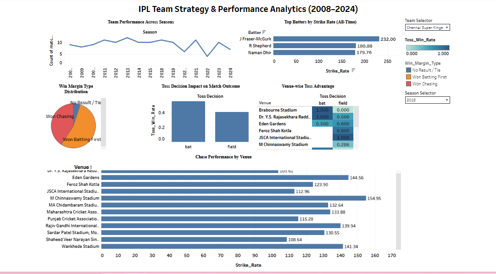

# IPL Team Strategy & Performance Analytics (Tableau)

An interactive Tableau dashboard analyzing 17 seasons of IPL data (2008–2024) to explore
toss impact, venue trends, team performance, and chase execution.

## Business Question

Does winning the toss and batting/bowling first predict match outcomes, how does this
vary by venue, and which teams execute run-chases most effectively?

## Live Dashboard

[View interactive dashboard on Tableau Public](https://public.tableau.com/authoring/Ipl_Data_Analysis/Dashboard1#1)

## Key Findings

- **Toss decision has only a marginal impact on match outcome** — win rates for teams
  choosing to bat vs field first are close to an even 50/50 split, suggesting toss
  strategy alone is not a strong predictor of winning.
- Win margin type is dominated by **"Won Batting First"** and **"Won Chasing"** in
  roughly comparable proportions, with a very small share of no-result/tied matches.
- Toss advantage varies meaningfully **by venue** — some venues show a strong bat-first
  or field-first bias, useful for venue-specific team strategy.
- Chase performance (average strike rate in successful run-chases) varies by venue,
  highlighting grounds more favorable to chasing teams.
- Top strike-rate leaderboard is filtered to batters with a **minimum of 60 balls
  faced**, to exclude small-sample-size outliers (see Data Quality Notes).

## Dashboard

## Tableau Skills Demonstrated

- **Data Connections**: connected two separate text file sources (`matches.csv` and
  `deliveries.csv`)
- **Data Blending**: blended match-level data with ball-by-ball delivery data (linked
  via `Id` ↔ `Match Id`) to calculate venue-level chase performance — a metric that
  cannot be derived from either file alone
- **Calculated Fields**: toss win rate, win margin categorization, strike rate, a
  balls-faced threshold (via LOD expression) to filter out statistically insignificant
  performances, and filter-matching fields tying parameters to specific sheets
- **Parameters**: a Team Selector (drives the season-performance trend line) and a
  Season Selector (filters toss, venue, and chase-performance views to a single season)
- **Dashboard Actions**: clicking a team on the season-trend chart cross-filters toss
  decision, win margin, venue, and batter charts

## Data Quality Notes

- Strike rate leaderboard required a **minimum 60 balls faced** filter — without it,
  the leaderboard was dominated by bowlers and tail-end batters who faced only 1-2
  balls and happened to hit boundaries, producing statistically meaningless strike
  rates over 200+. This mirrors a common real-world issue: small sample sizes can
  distort rate-based metrics if not filtered for a minimum volume threshold.
- The strike rate leaderboard is shown as an **all-time view** rather than
  season-filtered, since it draws from the `deliveries.csv` data source and blending
  a season filter into it introduced inconsistent results; this was a deliberate
  scope decision rather than an oversight.
- Team and season names in the raw data include historical renames (e.g., Delhi
  Daredevils → Delhi Capitals, Kings XI Punjab → Punjab Kings, Royal Challengers
  Bangalore → Royal Challengers Bengaluru) — these are treated as distinct entities
  in the dashboard, reflecting the data as officially recorded per season.

## Repository Contents

| File | Description |
|---|---|
| `dashboard_screenshot.png` | Dashboard preview image |
| `tableau_public_link.txt` | Link to the live interactive dashboard |

## Data Source

IPL Complete Dataset (2008–2024), Kaggle

## Author

**Greeshma Rao**
Data Analyst | Pursuing M.Sc. Data Science, University of Mumbai
